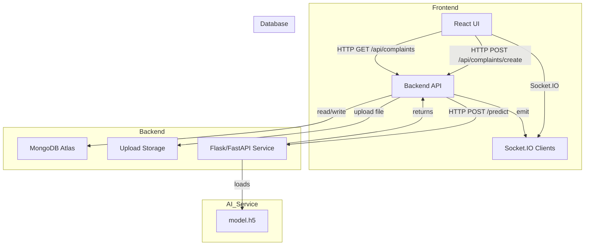

# SMARTFIX Architecture

## Overview

SMARTFIX is a full-stack complaint management system with these main layers:

- **Frontend**: React app in `frontend/frontend`
- **Backend**: Node.js and Express API in `backend`
- **AI service**: Python model service in `ai-model`
- **Database**: MongoDB Atlas
- **Realtime layer**: Socket.IO

## Architecture Diagram

## Components

### Frontend

- `frontend/frontend/src/components/RaiseComplaint.js` handles complaint submission.
- Uses `axios` to send multipart `FormData` with `image`, `description`, and `userId`.
- Uses `socket.io-client` to receive live updates.

### Backend

- `backend/server.js` configures Express, routes, and Socket.IO.
- `backend/config/multer.js` stores uploaded files to `backend/uploads/`.
- `backend/controllers/complaintController.js` receives uploads, calls the AI service, saves the complaint, and emits events.

### AI service

- `ai-model/app.py` loads `model.h5` and exposes `/predict`.
- Receives the image, resizes it to `224x224`, normalizes pixels, and predicts a category.
- Returns JSON with `category` and `confidence`.

### MongoDB

- Stores `User` and `Complaint` documents.
- Complaint records include:
  - `userId`, `description`, `image`, `category`, `status`, `priority`, `technicianId`, `aiConfidence`

## Data flow

1. User uploads image from the React form.
2. Frontend sends the file to the backend via `POST /api/complaints/create`.
3. Backend saves the uploaded image locally and forwards it to the AI service.
4. AI service returns the predicted category.
5. Backend stores the complaint in MongoDB.
6. Backend emits a Socket.IO update so clients refresh data.

## Deployment notes

- Frontend builds to static files via `npm run build`.
- Backend runs on a Node server using environment port.
- AI service runs separately on port `8000`.
- MongoDB Atlas connection is used by the backend.
